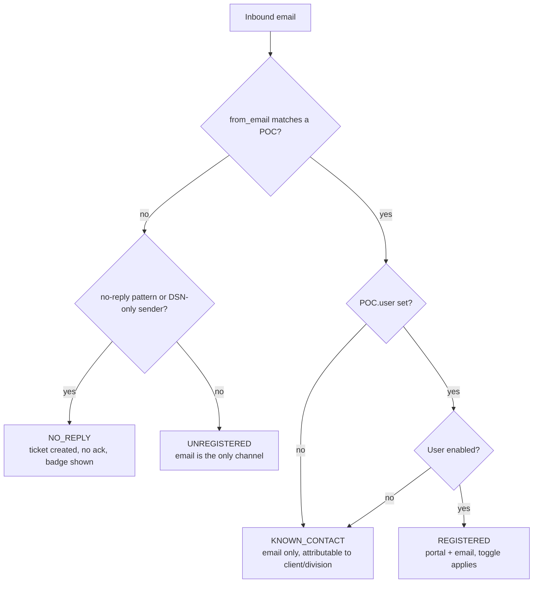
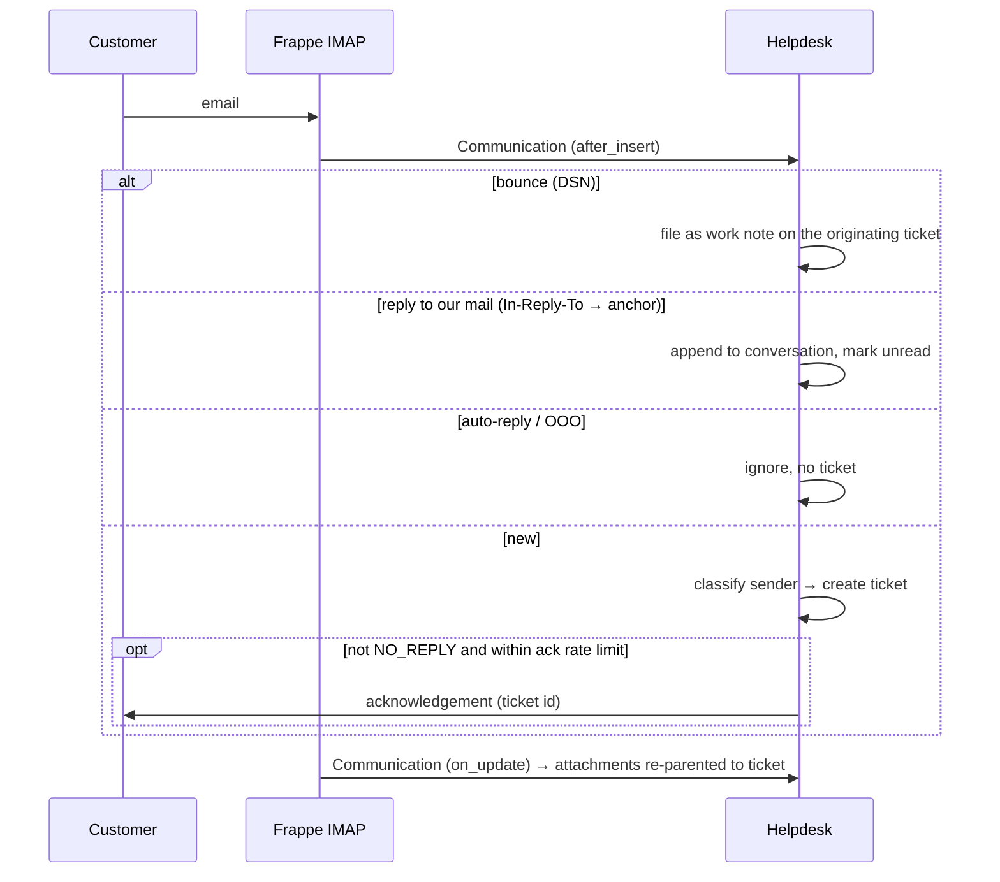
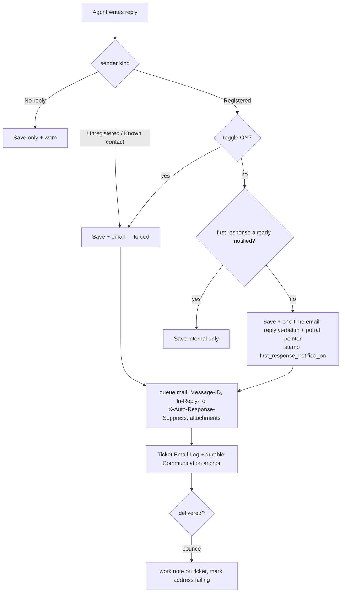
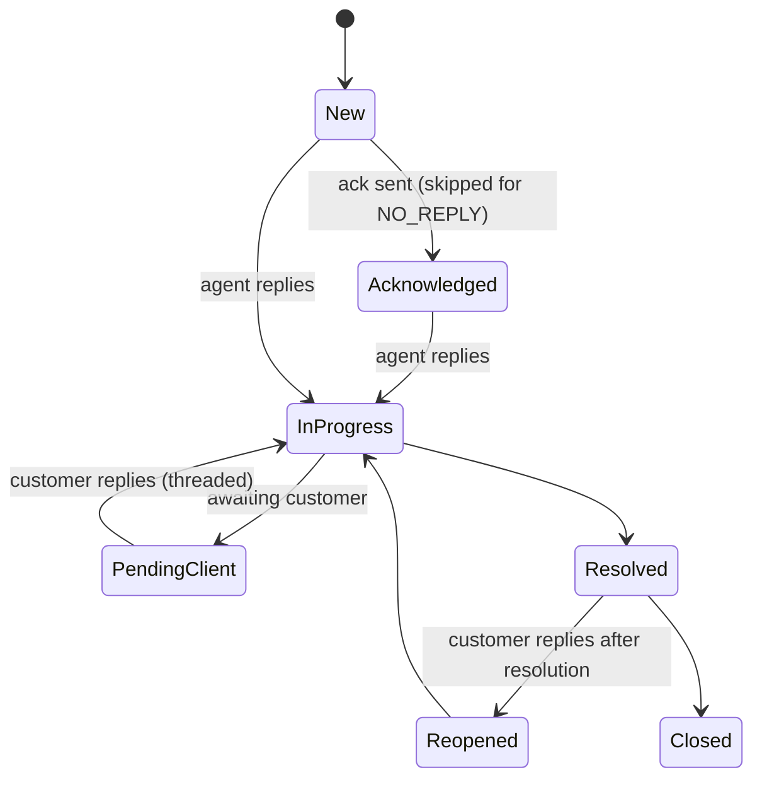

# Design — Email Reply Workflow for Tickets

**Status:** proposed, not implemented. D1 and D3 are **resolved**; D2 has a recommendation
awaiting confirmation (§2).
**Scope:** how a team member's reply reaches a customer, and how the UI makes the choice obvious.

---

## 1. Summary — read this first

Most of this feature already exists, under different names. The system has had a
two-stream reply model since before this spec was written:

| Spec asks for | Already exists as | Gap |
| --- | --- | --- |
| Reply that reaches the customer | `conversation` (`api.add_message`) — client-visible **and already emailed** | none |
| Internal note | `notes` (`api.add_note`) — permlevel 1, never emailed | none |
| "Send Reply over Email" toggle | composer `vis: "internal" \| "client"` switch | it's a *stream* choice, not an *email* choice |
| Email threading | Message-ID + durable Communication anchor | `References` chain not emitted |
| Ticket source shown | `source` field (`Portal`/`Email`) | no `Manual`/`API`; not surfaced prominently |

So the real work is **not** "build a reply system". It is:

1. **Enforce** that an unregistered sender's ticket cannot be answered internal-only.
2. **Classify** the sender (registered / known contact / unregistered / no-reply) and show it.
3. **One-time email** when a registered user's first reply would otherwise sit unseen in
   a portal they have never opened.
4. **No-reply detection.**
5. Close real gaps: outbound attachments, CC capture, `References`.

D1 is settled (§2): "Work Note" means the **client-visible reply**, so internal notes and
their permlevel-1 protection are out of scope. That ruling removes the two highest risks
in the original analysis and makes this an additive feature — no permission-model change,
no back-fill.

---

## 2. Blocking decisions

### D1 — RESOLVED: "Work Note" means the client-visible reply

> *"By work note I mean only the client visible notes, since we are not mailing any
> internal team members, it's always the clients."*

**Ruling: D1-a.** "Work Note" in the spec = this codebase's `conversation` stream
(`api.add_message`). The internal `notes` table is out of scope entirely and keeps its
permlevel-1 protection unchanged. The toggle controls **email delivery of a client-visible
reply**, never the visibility of an internal note.

Two consequences worth stating explicitly, because they simplify the build:

- Nothing in this feature touches the permission model. No back-fill, no per-row
  visibility flag, no weakening of the permlevel guarantee.
- **D3 collapses** (see below): if every message the toggle governs is client-visible by
  construction, emailing one verbatim cannot leak internal content.

The original analysis is kept below for the record.

---

The spec said *"The Work Note should always be saved in the client note section"* and
*"Send the Work Note as an email to the user"*.

In this codebase a **work note is internal by definition**: the `notes` child table sits at
`permlevel: 1`, and Frappe strips it from any client read (`test_work_notes_stripped_from_client_read`).
Agents write candidly there — triage reasoning, "known bug, don't promise a date",
delivery-failure records now filed by bounce handling. There is a separate, already
client-visible stream: `conversation`.

Three ways to resolve it:

| Option | What it means | Cost |
| --- | --- | --- |
| **D1-a — CHOSEN** | "Work Note" in the spec = the existing **conversation/reply**. The composer keeps two streams; the toggle controls *email delivery of a reply*, not visibility of a note. | Rename in UI only. Zero risk to existing notes. |
| D1-b | Work notes gain a per-row `is_client_visible` flag; the toggle flips it. | Every existing note must be back-filled as internal. Permlevel-1 protection has to be replaced with per-row filtering — a weaker, hand-rolled guarantee. High risk. |
| D1-c | Merge the two streams into one with a visibility flag. | Largest change; loses the server-enforced permlevel guarantee entirely. |

**Recommendation: D1-a.** The behaviour the spec wants is achievable by changing *when
email is sent* and *what the toggle is labelled*, without touching the permission model
that currently makes internal notes safe.

### D2 — There are three sender states, not two

`POC` has both `email` and `user` (Link → User, set only when invited). So:

| State | Condition | Portal access | Reply channel |
| --- | --- | --- | --- |
| **Registered** | POC exists **and** `POC.user` is set | yes | toggle applies |
| **Known contact** | POC exists, `POC.user` is null | **no** | email only |
| **Unregistered** | no POC matches `from_email` | no | email only |

The spec's two-state model would treat a *known contact* as registered and send them
"log in to the portal to continue" — a link they cannot use. Any ticket raised by a
customer contact who was never invited hits this.

**Recommendation:** three states. The toggle appears only for **Registered**.

### D3 — RESOLVED by D1: send the first response verbatim

The concern was that auto-emailing the first note could leak internal content. D1-a
removes it: the toggle only ever governs messages in the **client-visible** stream, so the
customer can already read them in the portal. Emailing one discloses nothing new.

**Ruling: verbatim**, exactly as the spec asks — the first response, plus a line telling
the client that further updates are in the portal and inviting them to sign in.

The agent still sees, before sending, that this particular reply will go out by email even
with the toggle off. Surprise is the failure mode here, not disclosure.

*(Superseded options, for the record: a neutral "we have responded, sign in to view"
notification was the safe default under D1-b/c, where the first note might have been
internal. It is unnecessary now and strictly worse — it makes the customer log in to read
one sentence.)*

---

## 3. Sender classification



Classification is **derived, never stored as the source of truth** — a stored value goes
stale the moment a POC is invited (edge case E8). It is computed on read and cached on the
ticket only as a denormalised hint for list views.

---

## 4. Data model changes

Additive only; no destructive migration.

### 4.1 `Support Ticket`

| Field | Type | Purpose |
| --- | --- | --- |
| `source` | Select — **add** `Manual`, `API` | Spec requires four sources; currently `Portal\|Email`. |
| `sender_kind` | Select (`Registered`/`Known Contact`/`Unregistered`/`No Reply`), read-only | Denormalised hint for list/filters. Recomputed on POC change. |
| `reply_to_email` | Data, read-only | The address replies actually go to. Today re-derived every send via `_ticket_contact_email`; storing it makes the audit trail honest and survives a POC being deleted. |
| `email_cc` | Small Text (JSON) | Captured from inbound `Communication.cc` — required for Reply-All (E2). |
| `first_response_notified_on` | Datetime, read-only | Drives the one-time notification (D3). Nullable = not yet sent. |
| `no_reply_reason` | Data, read-only | Which rule matched, so the badge can explain itself. |

### 4.2 `Ticket Message` (conversation child)

| Field | Type | Purpose |
| --- | --- | --- |
| `delivery_state` | Select (`Not Sent`/`Queued`/`Sent`/`Failed`/`Bounced`) | Per-message delivery, surfaced in the thread. |
| `message_id` | Data | Links the row to its outgoing mail — closes the audit trail (E10) and lets a bounce attach to the exact message. |

### 4.3 New doctype — `No Reply Rule`

Single-field configurable list: `pattern` (Data), `match_type` (`Exact`/`Prefix`/`Regex`),
`enabled` (Check), `note` (Data). Seeded with defaults (§7). Manager-only write.

### 4.4 New doctype — `Ticket Email Log`

Append-only audit of every outgoing ticket email. Existing `Email Queue` is purged at 30
days (this is the same purge that broke threading), so it cannot serve as the audit trail.

`ticket`, `message_id`, `to`, `cc`, `subject`, `kind` (`Ack`/`Reply`/`Notification`/`Status`),
`triggered_by` (User), `queued_on`, `delivery_state`, `failure_reason`.

---

## 5. Backend plan

### 5.1 Classification — `sender.py` (new module)

```
classify(ticket) -> SenderKind        # derived, cached per request
reply_address(ticket) -> str | None   # wraps existing _ticket_contact_email
can_receive_email(ticket) -> bool     # False for NO_REPLY and invalid addresses
```

Kept out of `email.py`, which is already the largest module and owns transport, not policy.

### 5.2 Reply dispatch — one entry point

Today `add_message` always emails and `add_note` never does. Both become callers of a
single policy function:

```
deliver_reply(ticket, body, attachments, *, requested_email: bool | None) -> DeliveryPlan
```

| Sender kind | `requested_email` | Outcome |
| --- | --- | --- |
| Unregistered / Known contact | ignored | **always** email; toggle not offered |
| Registered | `True` | email |
| Registered | `False`, no prior email | one-time email carrying the reply verbatim + portal pointer (D3) |
| Registered | `False`, notification already sent | internal only |
| No-reply | any | never email; UI warns |

Enforced **server-side**. The frontend hiding the toggle is presentation; the rule must
hold against a REST caller, consistent with how `_clamp_client_authored_fields` is written.

### 5.3 Threading completion

Already done: durable Message-ID anchor, `In-Reply-To` matching, bounce filing.
Remaining: emit `References` on outbound. Frappe's `add_headers` force-prefixes `X-`
(`email_body.py:358`), so `References` cannot be set through `email_headers` — it needs
either the `in_reply_to` parameter `frappe.sendmail` already accepts, or an override.
**Recommend `in_reply_to` first** (supported, no override) and measure whether mail clients
thread acceptably before taking on an `EmailAccount` subclass.

### 5.4 Outbound attachments

`notify_client_reply` currently sends HTML only — a reply with an attached file reaches the
customer without it. `frappe.sendmail` takes `attachments=[{"fname","fcontent"}]`; files
are already private and permission-gated on the ticket. Cap count and total size, and
never attach a file the *client* uploaded back to them.

---

## 6. Frontend plan

### 6.1 Ticket header — provenance strip

Always visible, next to the existing status/priority chips:

```
[ Email ]  [ Registered · r.mehta@thermax.test ]        ← green/neutral
[ Email ]  [ Unregistered sender · replies go by email ] ← amber
[ Email ]  [ ⚠ No-reply address · replies will not be delivered ] ← red, prominent
[ Portal ] [ Registered · r.mehta@thermax.test ]
```

### 6.2 Composer

| Sender kind | Composer |
| --- | --- |
| Registered | existing Internal/Client switch **plus** "Send reply over email" toggle, defaulting ON for the first reply, then remembering the last choice per ticket |
| Unregistered / Known contact | no toggle; a fixed line reads *"This reply will be emailed to r.mehta@thermax.test — the only channel available."* |
| No-reply | toggle disabled with a reason; internal notes still allowed; sending a client reply requires an explicit confirm |

The send button states what will happen — *"Send & email"* vs *"Save internal note"* —
rather than relying on the agent remembering the toggle position.

### 6.3 Thread

Each client-visible message carries a delivery chip: **Sent** / **Queued** / **Failed** /
**Bounced**. Bounced links to the work note that bounce handling already files.

---

## 7. No-reply detection

**Layered, in confidence order. Each layer alone has a false-positive mode.**

| Layer | Signal | Weight |
| --- | --- | --- |
| 1 | Configurable `No Reply Rule` list (exact/prefix/regex) | authoritative — an operator override always wins |
| 2 | Local-part pattern: `no-?reply`, `do-?not-?reply`, `donotreply`, `noreply`, `bounce`, `mailer-daemon`, `postmaster`, `notifications?` | high |
| 3 | RFC 3834 headers — `Auto-Submitted: auto-generated`, `Precedence: bulk`, `X-Auto-Response-Suppress` | highest, **but see below** |
| 4 | Observed behaviour: a prior mail to this address bounced (`Ticket Email Log`) | high, retroactive |

**Recommendation: layers 1 + 2 now, layer 4 next, layer 3 only if it proves necessary.**

Layer 3 is the theoretically correct one and I would normally lead with it — but it is not
available where we need it. Frappe's `Communication` stores **no raw headers** (only
`message_id`, `in_reply_to`); `show_attached_email_headers_in_content` keeps just
From/To/Subject/Date, and `message/delivery-status` parts are dropped entirely by
`process_part`. Reaching the headers requires overriding `EmailAccount`/`InboundMail`,
which couples us to framework internals across upgrades. Layers 1+2 cover the realistic
cases (`noreply@vendor.com`) at a fraction of the cost, and layer 1 gives operators an
escape hatch when a pattern is wrong.

Detection is **advisory, never destructive**: a no-reply ticket is still created, still
visible, still answerable internally. It suppresses the *automatic acknowledgement* (which
would otherwise bounce or loop) and warns the agent. Misclassification therefore costs a
warning badge, not a lost ticket.

---

## 8. Email flow

### 8.1 Inbound



### 8.2 Outbound reply



---

## 9. State flow per ticket type



Unregistered/known-contact tickets can only leave `Pending Client` via **inbound email**;
registered users can also do it from the portal. No-reply tickets can never leave it by
customer action — the agent must drive them, which is exactly why the badge matters.

---

## 10. Edge cases

| # | Case | Design |
| --- | --- | --- |
| E1 | **Attachments** | Inbound: re-parented to the ticket (done). Outbound: add to `sendmail`, capped, never echo a client's own file back. |
| E2 | **Multiple recipients / CC** | Persist inbound `Communication.cc` → `Ticket.email_cc`. Without it Reply-All is impossible. |
| E3 | **Reply vs Reply-All** | Default **Reply** (sender only). Reply-All opt-in per message, showing the exact recipient list. Defaulting to all risks disclosing one customer's ticket to a bystander who was CC'd once. |
| E4 | **Forwarded emails** | Already handled: first-contact mail skips quote-stripping, so forwarded content becomes the ticket body. The apparent sender is the forwarder — attribution follows `from_email`, which is correct. |
| E5 | **Invalid sender address** | Validate before send; `can_receive_email` false → treat as no-reply, warn, never silently drop. |
| E6 | **Delivery failures** | `Ticket Email Log.delivery_state`; `Email Queue` errors surfaced on the message chip. |
| E7 | **Bounce** | Implemented — filed as a work note on the originating ticket, matched by ticket id in the subject. Extend to flip `delivery_state` on the specific message via `message_id`. |
| E8 | **Sender later registers** | Classification is derived, so the ticket upgrades automatically. `Registered` unlocks the toggle mid-thread; already-sent emails are unaffected. |
| E9 | **Duplicate tickets** | Threading (Message-ID anchor) is the primary defence; subject-token fallback is the secondary. Both live. |
| E10 | **Audit trail** | `Ticket Email Log`, append-only, never purged — deliberately not `Email Queue`, which Frappe deletes at 30 days. |
| E11 | **Security / permissions** | Reply policy enforced server-side, not by hiding UI. Work notes stay permlevel 1. Attachments stay private and ticket-scoped. |
| E12 | **Threading** | Message-ID + durable anchor (live). Add `References`/`In-Reply-To` outbound. |
| E13 | **Rate limiting** | Ack cap per recipient/hour (live). Extend to a per-ticket outbound cap so a stuck automation can't hammer one customer. |
| E14 | **Spam** | Frappe applies no spam filtering; M365 filters upstream. Add a per-sender ticket-creation cap, and never auto-ack a sender already rate-limited. |

---

## 11. Risks and trade-offs

| Risk | Severity | Mitigation |
| --- | --- | --- |
| ~~D1-b/c leaks existing internal notes~~ | — | **Retired by D1-a.** Internal notes are out of scope; permlevel 1 is untouched. |
| ~~Auto-notification leaks note text~~ | — | **Retired by D1-a.** The toggle only governs client-visible messages. |
| Agent does not expect the first reply to be emailed with the toggle off | medium | Composer states the outcome on the button and warns on the first reply specifically. |
| **No-reply false positive** silently strands a real customer | high | Detection is advisory only — ticket always created; operator override via `No Reply Rule`. |
| **Reply-All discloses a ticket to a bystander** | high | Default to Reply; make the recipient list explicit on Reply-All. |
| Header-based detection couples us to Frappe internals | medium | Deferred (§7). Revisit only if layers 1+2 measurably underperform. |
| `Ticket Email Log` growth | low | Append-only, one row per outbound mail; prune far beyond any audit need, never at 30 days. |
| Toggle default becomes muscle memory, wrong reply goes out | medium | Button text states the outcome; provenance strip always visible. |

---

## 12. Recommended approach

Sequenced so each phase is independently shippable and reversible.

**Phase 1 — classification and truth in the UI (no behaviour change).**
`sender.py`, `sender_kind` + `no_reply_reason`, `No Reply Rule` seeded, provenance strip,
`source` extended to `Manual`/`API`. Ships value immediately: agents stop replying into
no-reply addresses. Nothing about delivery changes, so it cannot regress mail.

**Phase 2 — reply policy.**
`deliver_reply` as the single enforced entry point; forced email for unregistered/known
contact; toggle for registered; one-time neutral notification; `Ticket Email Log`.

**Phase 3 — fidelity.**
Outbound attachments, `email_cc` capture, Reply/Reply-All, `In-Reply-To` outbound,
per-message `delivery_state` wired to bounces.

**Why this order.** Phase 1 is pure observability and the only phase with no delivery risk,
yet it removes the most common operational surprise. Phase 2 changes who receives mail and
deserves to land alone, where a regression is unambiguous. Phase 3 is polish that depends
on Phase 2's plumbing.

**Do not** start with the toggle. It is the most visible part of the spec and the least
valuable: for registered users the system already emails client-visible replies, so the
toggle mostly *removes* mail. The genuine defect is that an unregistered sender's ticket
can be answered with an internal note that reaches nobody — Phase 2 fixes that, and Phase 1
makes it visible.

---

## 13. Open questions

1. ~~**D1**~~ — resolved: client-visible reply (D1-a).
2. **D2** — confirm three sender states, and whether a *known contact* (POC, never invited)
   should be auto-invited on first reply instead of treated as email-only.
   *Recommendation: three states, no auto-invite — provisioning a login is an
   outward-facing act that should not be a side effect of replying.*
3. ~~**D3**~~ — resolved by D1: verbatim first response + portal pointer.
4. Should a no-reply sender still receive the acknowledgement? The spec says "may still be
   sent if required"; recommendation is **no** — it cannot be read and may bounce or loop.
5. Retention for `Ticket Email Log` — indefinite, or a compliance-driven window?
